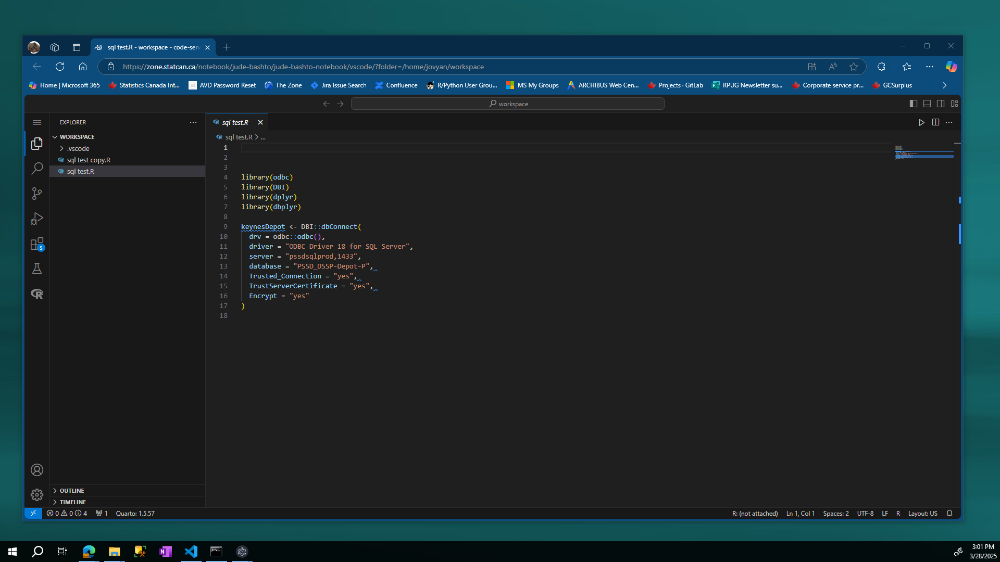
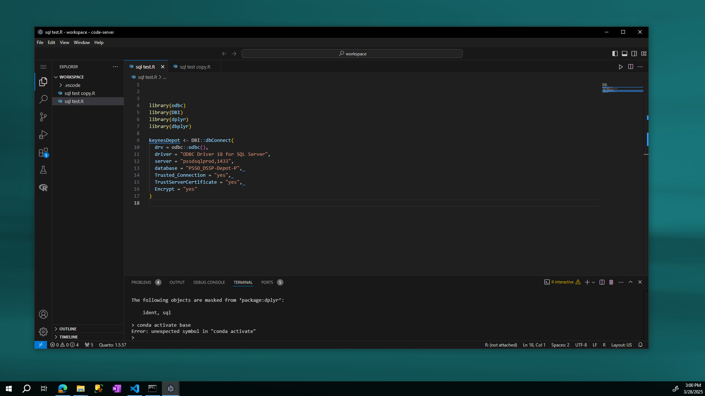

# The Zone Electron App

The Zone Electron App is a minimal Electron-based application designed to provide a dedicated browsing experience for the Zone. It launches loads the Zone site without any additional browser distractions, ensuring you get a clean, focused experience.

## Features

- **Dedicated Browser:** Access only the Zone website.
- **Fullscreen Windowed Mode:** Automatically maximizes to fill the screen while remaining windowed (with borders). Fullscreen is allowed, but not a good idea. 
- **Custom Icon:** Displays a custom logo for a branded look.
- Scripts can be opened in different screens as part of the same notebook. 

## Screenshots

The first image below shows how the Zone looks like with the default web browser (Microsoft Edge): 



The second image below shows how the Zone looks like with the Electron web browser:



Clearly, the second browser makes for a nicer user experience. 

## Prerequisites

- In order to run this code from source, you will need `Node.js`. Some users may already have `Node.js` on single session AVD. 
- To check if you have `Node.js`, press `Win`+`R` on and type `cmd`. Press `Enter` to open the **Command Console**. In the command console, type: 
    ```bash
    node -v 
    ```
    If you have `Node.js`, you should see the version number of `Node.js` on your AVD. 
-  If you don't have `Node.js` you need to request for it to be installed on your Single Session AVD. 

## How to Run

1. **Clone this repository and cd to the root**
   ```bash
   git clone https://gitlab.k8s.cloud.statcan.ca/os-collab/applications/the-zone-electron-application.git
   cd zone-electron-app
   ```

2. **Install dependencies**
    ```bash
    npm install 
    ```
- **Note**: All **direct** dependencies can be found in the `package.json`. 
    - All dependencies are found in `package-lock.json`

3. **Start the app** 

    ```bash
    npm start
    ```


Needed: 

- This app needs to be built before being shipped. This repo contains the source code only. 

## How to Compile as an Executable

This application can be compiled as an executable by running the following command from your project directory: 

```bash
npx electron-packager . ZoneElectronApp --platform=win32 --arch=x64 --icon=assets/logo.png
```

## Security

The following cybersecurity best practices were implemented in this Electron app:

1. [Disabled Node integration](https://www.electronjs.org/docs/latest/tutorial/security#2-do-not-enable-nodejs-integration-for-remote-content): This prevents remote content from accessing Node.js APIs, reducing the risk of arbitrary code execution.

2. [Context Isolation](https://www.electronjs.org/docs/latest/tutorial/context-isolation) enabled: Scripts running in the renderer do not have direct access to Electron’s internal APIs.

3. [Process Sandboxing](https://www.electronjs.org/docs/latest/tutorial/sandbox) enabled: The sandbox limits the harm that malicious code can cause by limiting access to most system resources — sandboxed processes can only freely use CPU cycles and memory. When the sandbox is enabled, renderer processes can only perform privileged tasks (such as interacting with the filesystem, making changes to the system, or spawning subprocesses) by delegating these tasks to the main process via inter-process communication (IPC).

4. Handling [session permission requests](https://www.electronjs.org/docs/latest/tutorial/security#5-handle-session-permission-requests-from-remote-content) from remote content: by default all permission requests are denied. This includes any requests for peripheral access. 

5. Using a dedicated session partition: This electron app uses an [ephemeral session](https://catonmat.net/what-is-an-ephemeral-browser) (like incognito), so it will never store your session data, cookies, or login. When you close the Electron app, you will have effectively logged out and will need to re-authenticate with Windows. This can be turned off if it is overkill, simple specify the session as persistent in `main.js`. 
    - partition: 'Zone-partition' -> partition: 'persist:Zone-partition'

The following cybersecurity best practices have not yet been implemented in this Electron app:

1. Defining a [Content Security Policy](https://www.electronjs.org/docs/latest/tutorial/security#7-define-a-content-security-policy): I am assuming The Zone has its own content security policy. I am not entirely sure it is allowed to overwrite this by intercepting the zone's CSP and overriding it !

2. Popups are allowed: I like the fact that new scripts open in new windows! And I don't see the risk. 